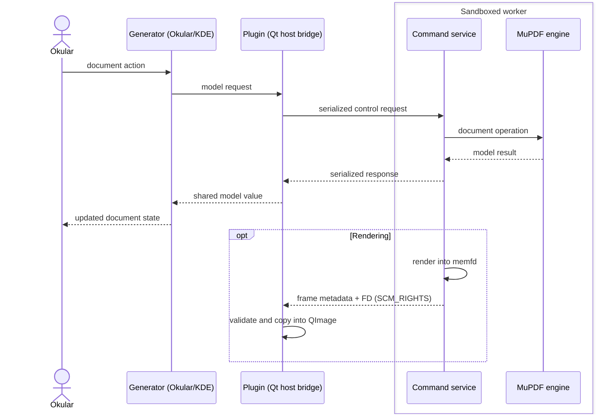

# Architecture

okular-mupdf-ng keeps document parsing, rendering, and mutation in a separate
MuPDF worker. The host-side generator owns Okular integration; it never shares
MuPDF objects or C++ pointers with the worker.



## Layer boundaries

### Generator

`src/generator/` is the only Okular/KDE-facing layer. It implements the
generator interface, exposes configuration UI, and converts shared models into
Okular pages, annotations, form proxies, signatures, and document metadata.
Configuration-to-model translation also lives here.

### Plugin

`src/plugin/` is a pure-Qt host bridge: it has no Okular or generator type
dependency. It starts and supervises the worker, owns the IPC client and frame
mapping, manages OCR scheduling and persistent caches, and hosts NSS-backed
certificate and signing support.

### Shared layer

`src/shared/` defines protocol messages, serializable data models, validation,
logging, transport helpers, and shared-memory frame rules. It is the only data
contract between host and worker and has no Okular/KDE GUI dependency.

### Worker

`src/worker/` is a native C++23 process with no Qt or Okular dependency. Its
runtime dispatches requests to PDF and EPUB document engines. The engines own
MuPDF document lifetime, page operations, rendering, forms, annotations,
signatures, OCR, metadata, and save operations.

The worker link-boundary test enforces that it remains free of host GUI
libraries. The plugin-boundary test enforces the plugin's lack of Okular and
generator dependencies.

## IPC and rendering

The plugin creates private Unix-domain control and descriptor sockets for each
worker session. Control requests are serialized shared-model messages. Input
documents and output files are passed only as descriptors; the worker does not
open arbitrary document paths.

Rendered frames use a separate descriptor path. Each frame contains a fixed
header followed by RGBA pixels, and the plugin validates its header and
geometry before exposing the mapped pixels directly through a `QImage`; no
pixel copy is made.

The worker keeps up to eight reusable `memfd` slots with a combined 128 MiB
budget. A new slot's descriptor is passed with `SCM_RIGHTS` once, then later
renders reuse the plugin's existing read-only mapping. When the final `QImage`
reference is destroyed, the plugin releases the slot lease and the worker may
reuse it. If no compatible slot is available, the worker uses a transient
frame, which the plugin unmaps when its final `QImage` reference is destroyed.

One rendered frame is limited to 128 MiB of pixel data. Larger requests fail
cleanly instead of creating an unbounded transfer.

## Persistent caches

Persistent cache code lives in `src/plugin/caching/` and is owned by the host,
not the sandboxed worker.

- OCR results are cached per document identity, language, DPI, and page. A
  valid empty OCR page is retained as a cache hit.
- EPUB uses one cache file per document and layout fingerprint. The file has
  independently stored accelerator and compressed-outline sections, so either
  result can be added without discarding the other.
- The EPUB layout fingerprint includes font size, family, page size, and custom
  CSS. Changing any of them intentionally selects a different accelerator and
  outline cache entry.

## Worker security boundary

The worker is a capability process. The parent is the capability broker: it
passes only the descriptors and configured read-only tessdata directories the
worker needs.

On Linux, hardening is applied after IPC endpoints are established:

- Landlock restricts filesystem access to the build-time tessdata directory
  and optional configured directories.
- User, network, and IPC namespaces isolate identity and network access when
  unprivileged namespaces are available.
- Seccomp restricts system calls when libseccomp and the host kernel support
  it.
- Resource limits cap address space and CPU time; release builds also disable
  worker core dumps and inherited descriptors.

Hardening is best-effort for portability. The worker reports its actual
sandbox status through the initial ping, so the host can distinguish fully
hardened from degraded environments.

The worker supports PDF and EPUB only. Its build-time tessdata default is
`TESSDATA_DIR` (`/usr/share/tessdata` by default); the plugin may pass
additional absolute directories from its hidden advanced configuration. The
worker also provides `--help` and `--version` for diagnostics, although normal
operation is exclusively through private plugin IPC.

## Build and test layout

The default build downloads and statically links the pinned MuPDF found 
in `cmake/mupdf.version`. MuPDF is built with PDF and EPUB support while unused
document formats, MuJS, and curl support are disabled. Linker garbage collection
removes unused static sections. `-DUSE_SYSTEM_MUPDF=ON` opts into a compatible
system package.

MuPDF-linked worker, EPUB, OCR, signature, and integration tests are collected
in one `test_mupdf` executable to avoid repeatedly linking large static MuPDF
binaries. Cache, generator, security, and boundary tests remain small focused
executables.

## Source tree

```text
src/
├── generator/          # Okular integration, conversion, proxies, configuration
├── plugin/             # Qt worker bridge, caching, OCR, NSS integration
├── shared/             # IPC protocol, models, transport, validation
└── worker/             # isolated native worker
    ├── engine/         # PDF/EPUB engines, OCR, signing
    ├── runtime/        # request dispatch and worker server
    └── sys/            # sandboxing, limits, system integration
```
