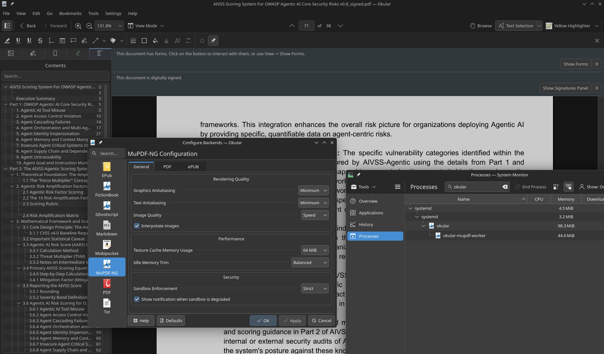

# okular-mupdf-ng

A secure and fast PDF and EPUB generator for Okular.
> Beta: Real-world testers are welcome. Please report any issue via Github Issues.



---

## How to install
Prebuilt packages for common KDE distros are available for download [here](https://github.com/l4rzy/okular-mupdf-ng/releases).
Alternatively, you can [build it yourself](#building-and-testing).

---

## Architecture

The document engine runs in an isolated worker process, where potentially unsafe
documents are parsed and rendered. See [ARCHITECTURE.md](ARCHITECTURE.md) for
component responsibilities, IPC, shared rendering buffers, sandboxing, caches,
and the source-tree layout.

---

## Feature Comparison

| Feature Category | Capabilities | okular-mupdf-ng | Poppler (official) |
|---|---|:---:|:---:|
| **Safety & Isolation** | Sandboxed out-of-process worker (Landlock, Seccomp, namespaces, resource limits) | ✓ | ✗ (in-process execution) |
| **Formats** | PDF, EPUB | ✓ (PDF + EPUB) | ✓ (Epub supported in another plugin) |
| **Forms** | AcroForm text inputs, checkboxes, radio buttons, and choices | ✓ | ✓ |
| **Signatures** | Verification and creation (NSS crypto) | ✓ | ✓ |
| **Cert Manager** | NSS Certificate Manager | ✓ | ✗ |
| **Annotations** | Text, highlight, line, shape, ink, stamp, caret | ✓ | ✓ |
| **Document Tools** | Text search, outline/TOC, links, fonts, metadata, embedded files | ✓ | ✓ |
| **Printing & Exporting** | Print & Export | ✓ | ✓ |
| **OCR** | Built-in Tesseract page OCR engine | ✓ | ✗ |


## Requirements to build

- A C++23 compiler (Clang preferred), CMake 3.20 or newer, Ninja, mold, `pkg-config`, and the usual
  build tools.
- Qt 6, KDE Frameworks 6, and Okular 6 development packages.
- NSS/NSPR for certificate and signature operations.
- Build dependencies required by MuPDF, including FreeType, HarfBuzz, JPEG,
  JBIG2, OpenJPEG, Brotli, Leptonica, and Zlib.
- `python3 >=3.12` when using the bundled MuPDF source for the first time (verified with sha256).

The default build statically links the pinned MuPDF source. The build
script downloads it to `thirdparty/mupdf-{version}-source/` automatically when
absent and verifies its SHA-256. The bundled build uses MuPDF's bundled Gumbo
source by default; pass `-DUSE_SYSTEM_GUMBO=ON` to use a system Gumbo package
instead.
A compatible system MuPDF package (>=1.28.0) can instead be selected with
`-DUSE_SYSTEM_MUPDF=ON`.

OCR uses the build-time `TESSDATA_DIR` setting, which defaults to
`/usr/share/tessdata`. Additional tessdata directories can be configured in
the hidden `Advanced/TessDataDirectories` configuration entry.

## Building and testing

The Makefile delegates to `scripts/build.sh`; both interfaces are equivalent.
The script uses Ninja and builds MuPDF with all available CPUs.

```bash
# Debug build and full test suite
make dev
# or: ./scripts/build.sh dev

# Optimized release build
make release
# or: ./scripts/build.sh release

# Configure, build, and run the debug test suite
make test

# Format src/ and tests/
make format

# Remove build directories
make clean
```

For an already configured build tree, run all tests with:

```bash
ctest --test-dir build --output-on-failure
```

## Arch Linux

The package recipe lives in `dist/` and downloads the pinned MuPDF source in
its `prepare()` step:

```bash
cd dist
makepkg -si
```

## Credits
- [Okular Poppler Backend](https://invent.kde.org/graphics/okular/-/tree/master/generators/poppler)
- [SumatraPDF](https://github.com/sumatrapdfreader/sumatrapdf)
- [Zathura MuPDF Backend](https://github.com/pwmt/zathura-pdf-mupdf)

## License

Licensed under the [GNU General Public License v3.0 or later](COPYING)
(`GPL-3.0-or-later`).
