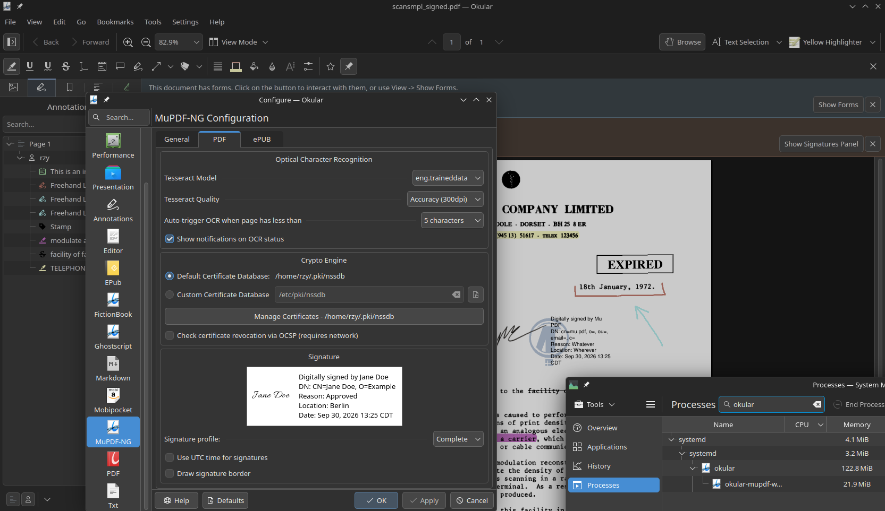

# okular-mupdf-ng

  
  
  
  

A **secure** and fast PDF and ePUB generator for Okular. Document rendering is moved to an isolated and hardened worker process. This reduces the impact of MuPDF vulnerabilities while keeping Okular's desktop integration seamless.
<!-- Note -->
> [!IMPORTANT]
> This project is in beta and is not stable yet. See the [feature maturity matrix](MATURITY.md) for feature-specific maturity and test coverage. If you encounter any issue, please report via Github Issues. If you're working on an important PDF, use the official PDF backend (Poppler generator) that comes with Okular instead.

---

## Installation

See [INSTALL.md](INSTALL.md) for prebuilt packages, build requirements, and
instructions for building from source.

---

## Motivation
Okular is an amazing piece of software: it's packed with good features; it's also extendable with a flexible plugin system. However, there are caveats that hold it back. This plugin solves the following issues with the current Okular's PDF and ePUB backends, with the hope of making it more complete:
 - PDF is a complex format, it should not be parsed and rendered in Okular's memory space unconfined.
 - PDF backend with Poppler is rich in features, but sluggish on big PDFs. This is a known weakness of Poppler.
 - Rendering quality of the default ePUB backend is terrible, plus rendering speed is also painstakingly slow even on a high-end CPU.

---

## Architecture

The document engine runs in an isolated worker process, where potentially unsafe
documents are parsed and rendered. See [ARCHITECTURE.md](ARCHITECTURE.md) for
component responsibilities, IPC, shared rendering buffers, sandboxing, caches,
and the source-tree layout.

---

## Feature Comparison

| Feature Category | Capabilities | okular-mupdf-ng | Okular official PDF & ePUB backends |
|---|---|:---:|:---:|
| **Safety & Isolation** | Sandboxed out-of-process worker (Landlock, Seccomp, namespaces, resource limits) | ✓ | ✗ (in-process execution) |
| **Formats** | PDF, ePUB | ✓ | ✓ |
| **ePUB customisation** | Custom CSS, Pagesizes | ✓ | ✗ |
| **ePUB export** | Export ePUB to PDF | ✓ (via MuPDF rendering) | ✓ (basic, via document print) |
| **PDF Forms** | AcroForm text inputs, checkboxes, radio buttons, choices, and push buttons | ✓ (incl. JS calculation & button/field-event actions; XFA detected only) | ✓ (AcroForm; JS stored, not executed; XFA detected only) |
| **Signatures** | Verification and creation (NSS crypto) | ✓ | ✓ (plus GPG) |
| **Cert Manager** | NSS certificate manager; generate RSA and ECDSA P-256 signing certificates | ✓ | ✗ |
| **Annotations** | Text, highlight, line, shape, ink, stamp, caret | ✓ | ✓ (plus sound, movie & file-attachment annotations) |
| **Annotations export** | Export PDF annotations to XFDF | ✓ | ✗ |
| **Flattened PDF export** | Bake annotations and form fields into PDF page content | ✓ | ✗ |
| **Document Tools** | Text search, outline/TOC, links, fonts, metadata, embedded files | ✓ | ✓ |
| **PDF Heuristic Outline** | Outline generation for PDFs that don't have embedded outline | ✓ | ✗ |
| **Printing & Exporting** | Print & Export | ✓ | ✓ |
| **PDF layers** | Toggle optional content in the Layers sidebar | ✓ | ✓ (PDF) |
| **OCR** | Built-in Tesseract page OCR engine | ✓ | ✗ |

## Limitations

- MuPDF's ePUB support is incomplete. ePUB 3.0 is not fully
  supported, so some documents may render incorrectly.
- The NSS cryptographic code has not been fully audited.
- Sandbox is Linux only and its availability depends on Linux kernel and system support. Default to Strict Enforcement.
- Worker restart can not recover unsaved forms.

See the [feature maturity matrix](MATURITY.md) for feature-specific maturity and
automated test coverage.

## Contributing

See [CONTRIBUTING.md](CONTRIBUTING.md) for contribution and testing guidelines.
See [SECURITY.md](SECURITY.md) for the security contact.

## Credits

This project learned from amazing projects below

- [Okular Poppler Backend](https://invent.kde.org/graphics/okular/-/tree/master/generators/poppler) - Okular integration
- [SumatraPDF](https://github.com/sumatrapdfreader/sumatrapdf) - MuPDF API usage
- [Zathura MuPDF Backend](https://github.com/pwmt/zathura-pdf-mupdf) - Seccomp rules
- [Sioyek](https://github.com/ahrm/sioyek) - MuPDF API usage

## License

Original project source code is licensed under the
[GNU General Public License v3.0 or later](COPYING) (`GPL-3.0-or-later`),
unless otherwise indicated.

Third-party components retain their respective licenses and copyright notices:

- **MuPDF**, including its [signature emblem](src/generator/config/signature_emblem.hpp):
  [GNU Affero General Public License v3.0 or later](thirdparty/mupdf-COPYING)
  (`AGPL-3.0-or-later`). The worker links against MuPDF; its license applies to
  the engine as well as the emblem. GPLv3 permits this combination, with the
  AGPL's network-interaction requirements applying to the combined work; see
  [GPLv3 section 13](https://www.gnu.org/licenses/gpl-3.0.html#section13).
- **Allura font**: [SIL Open Font License 1.1](thirdparty/allura/OFL.txt).
- **zpp::bits**: [MIT License](thirdparty/zpp/LICENSE).
- **cxxopts**: [MIT License](thirdparty/cxxopts/LICENSE).

Other dependencies and bundled resources, including fonts embedded by MuPDF,
retain their upstream licenses. This summary does not replace the full license
texts or component-specific notices.
