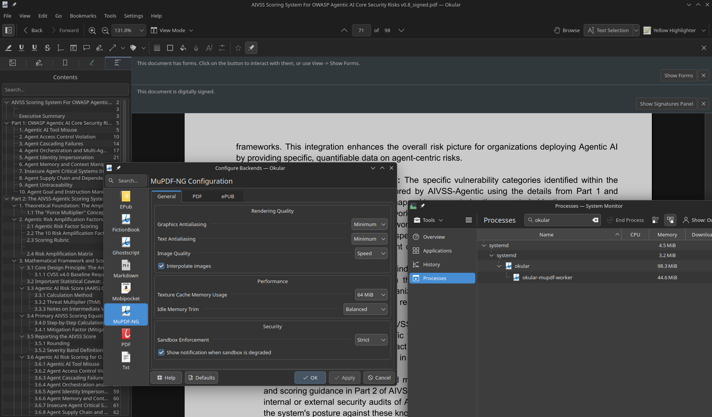

<p align="center">

</p>

# okular-mupdf-ng

[](https://github.com/l4rzy/okular-mupdf-ng/blob/main/COPYING)
[](https://github.com/l4rzy/okular-mupdf-ng/commits)
[](https://github.com/l4rzy/okular-mupdf-ng/actions)
[](https://github.com/l4rzy/okular-mupdf-ng/releases)

A secure and fast PDF and ePUB generator for Okular.
<!-- Note -->
> [!NOTE]
> This project is in beta and is not stable yet. See the [feature maturity matrix](MATURITY.md) for feature-specific maturity and test coverage. If you encounter any issue, please report via Github Issues. If you're working on an important PDF, use the official PDF backend (Poppler generator) that comes with Okular instead.


---

## How to install

Prebuilt packages for supported distros are attached to each
[GitHub release](https://github.com/l4rzy/okular-mupdf-ng/releases). The links
below always resolve to the latest release.

Installing this plugin will override the default backend for PDF and ePUB. You
can select the backend of your choice every time you open a document by enabling
the "Show backend selection dialog" option in Okular.

### Arch Linux

```bash
yay -U https://github.com/l4rzy/okular-mupdf-ng/releases/latest/download/okular-mupdf-ng-0.2.14-1-x86_64.pkg.tar.zst
```

### Fedora

```bash
# Fedora 44 x86_64
sudo dnf install https://github.com/l4rzy/okular-mupdf-ng/releases/latest/download/okular-mupdf-ng-0.2.14-1.fc44.x86_64.rpm

# Fedora 43 aarch64/Asahi Linux
sudo dnf install https://github.com/l4rzy/okular-mupdf-ng/releases/latest/download/okular-mupdf-ng-0.2.14-1.fc43.aarch64.rpm
```

### openSUSE Tumbleweed

```bash
sudo zypper install https://github.com/l4rzy/okular-mupdf-ng/releases/latest/download/okular-mupdf-ng-0.2.14-1.tumbleweed.x86_64.rpm
```

### Debian 13

```bash
curl -LO https://github.com/l4rzy/okular-mupdf-ng/releases/latest/download/okular-mupdf-ng_0.2.14-1_amd64_debian-13.deb
sudo apt install ./okular-mupdf-ng_0.2.14-1_amd64_debian-13.deb
```

### Ubuntu 26.04

```bash
curl -LO https://github.com/l4rzy/okular-mupdf-ng/releases/latest/download/okular-mupdf-ng_0.2.14-1_amd64_ubuntu-26.04.deb
sudo apt install ./okular-mupdf-ng_0.2.14-1_amd64_ubuntu-26.04.deb
```

### Any other distro

Build from source — see [Building and testing](#building-and-testing).

---

## Motivation
Okular is an amazing piece of software: it's packed with good features; it's also extendable with a flexible plugin system. However, there are caveats that hold it back. This plugin solves the following issues with the current Okular's PDF and ePUB backends, with the hope of making it more complete:
 - PDF is a complex format, it should not be parsed and rendered in Okular's memory space unconfined.
 - PDF backend with Poppler is rich in features, but sluggish on big PDFs. This is a known weakness of Poppler.
 - Rendering quality of the default ePUB backend is terrible, plus rendering speed is also painstakingly slow even on a high-end CPU.

---

## Architecture

The document engine runs in an isolated worker process, where potentially unsafe
documents are parsed and rendered. See [ARCHITECTURE.md](ARCHITECTURE.md) for
component responsibilities, IPC, shared rendering buffers, sandboxing, caches,
and the source-tree layout.

---

## Feature Comparison

| Feature Category | Capabilities | okular-mupdf-ng | Okular official PDF & ePUB backends |
|---|---|:---:|:---:|
| **Safety & Isolation** | Sandboxed out-of-process worker (Landlock, Seccomp, namespaces, resource limits) | ✓ | ✗ (in-process execution) |
| **Formats** | PDF, ePUB | ✓ | ✓ |
| **ePUB customisation** | Custom CSS, Pagesizes | ✓ | ✗ |
| **ePUB export** | Export ePUB to PDF | ✓ | ✗ |
| **PDF Forms** | AcroForm text inputs, checkboxes, radio buttons, and choices | ✓ | ✓ (plus basic XFA & JS support) |
| **Signatures** | Verification and creation (NSS crypto) | ✓ | ✓ (plus GPG) |
| **Cert Manager** | NSS Certificate Manager | ✓ | ✗ |
| **Annotations** | Text, highlight, line, shape, ink, stamp, caret | ✓ | ✓ |
| **Annotations export** | Export PDF annotations to XFDF | ✓ | ✗ |
| **Document Tools** | Text search, outline/TOC, links, fonts, metadata, embedded files | ✓ | ✓ |
| **Printing & Exporting** | Print & Export | ✓ | ✓ |
| **OCR** | Built-in Tesseract page OCR engine | ✓ | ✗ |


## Requirements to build

- A C++23 compiler (Clang preferred), CMake 3.20 or newer, Ninja, mold, `pkg-config`, and the usual
  build tools.
- Qt 6, KDE Frameworks 6, and Okular 6 development packages.
- NSS/NSPR for certificate and signature operations.
- Build dependencies required by MuPDF, including FreeType, HarfBuzz, JPEG,
  JBIG2, OpenJPEG, Brotli, Leptonica, and Zlib.
- `python3 >=3.12` when using the bundled MuPDF source for the first time (verified with sha256).

## Building and testing

The Makefile delegates to `scripts/build.sh`; both interfaces are equivalent.
The script uses Ninja and builds MuPDF with all available CPUs.

```bash
# Debug build and full test suite
make dev
# or: ./scripts/build.sh dev

# Optimized release build
make release
# or: ./scripts/build.sh release

# Configure, build, and run the debug test suite
make test

# Format src/ and tests/
make format

# Remove build directories
make clean
```

For an already configured build tree, run all tests with:

```bash
ctest --test-dir build --output-on-failure
```

## Credits
- [Okular Poppler Backend](https://invent.kde.org/graphics/okular/-/tree/master/generators/poppler)
- [SumatraPDF](https://github.com/sumatrapdfreader/sumatrapdf)
- [Zathura MuPDF Backend](https://github.com/pwmt/zathura-pdf-mupdf)

## License

Licensed under the [GNU General Public License v3.0 or later](COPYING)
(`GPL-3.0-or-later`).
